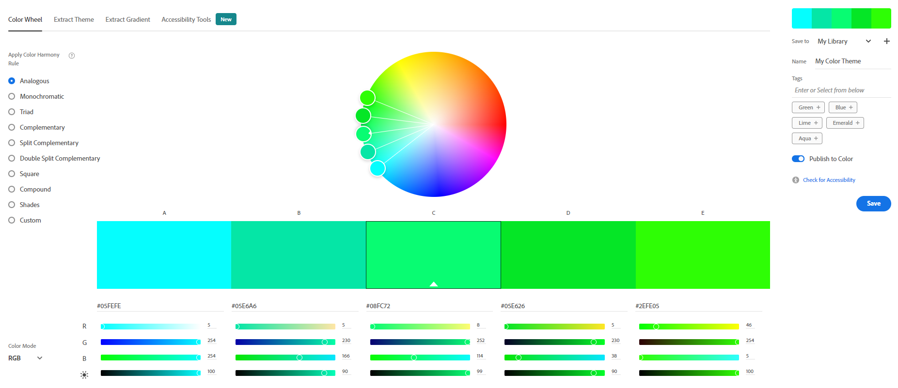
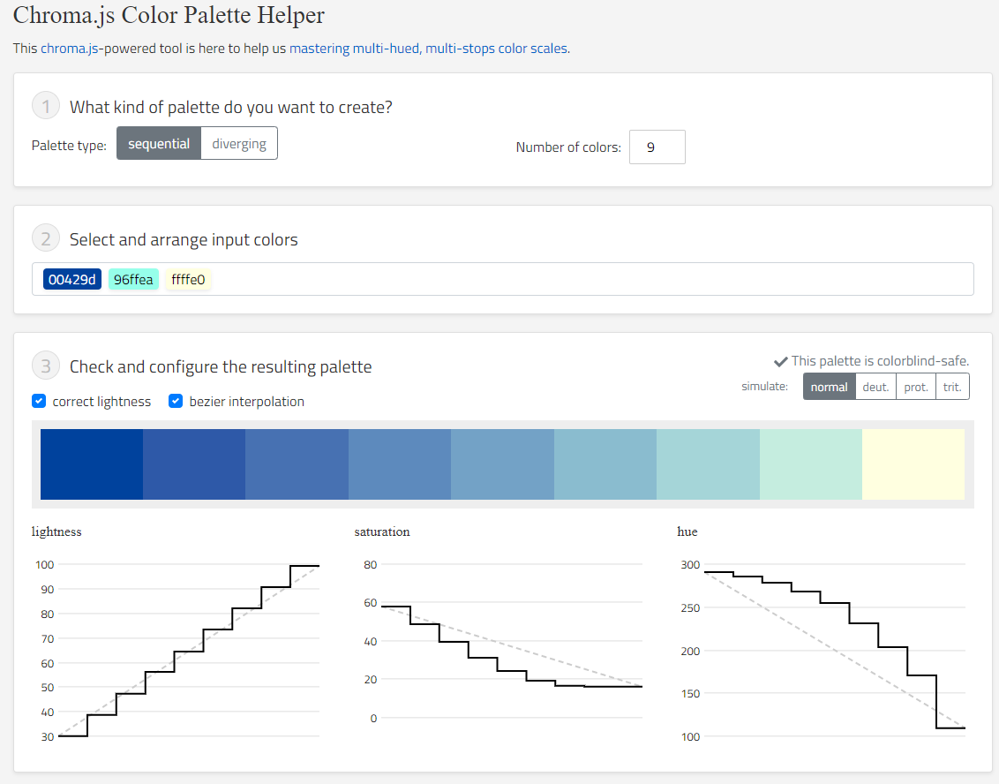
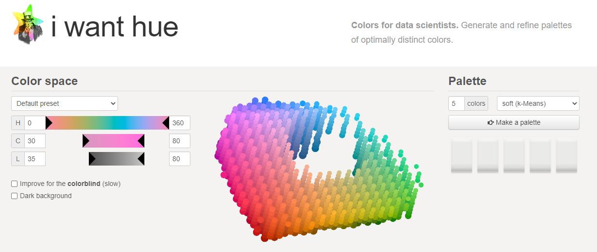
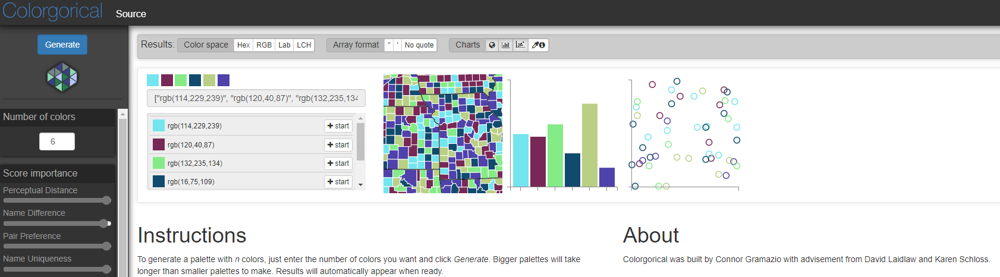
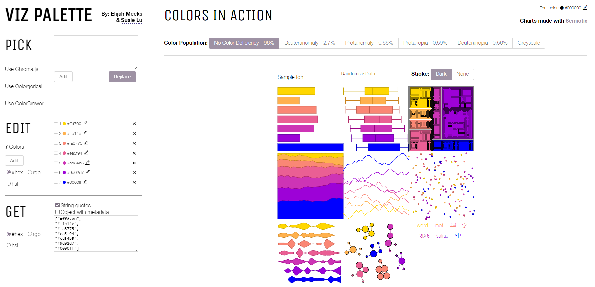
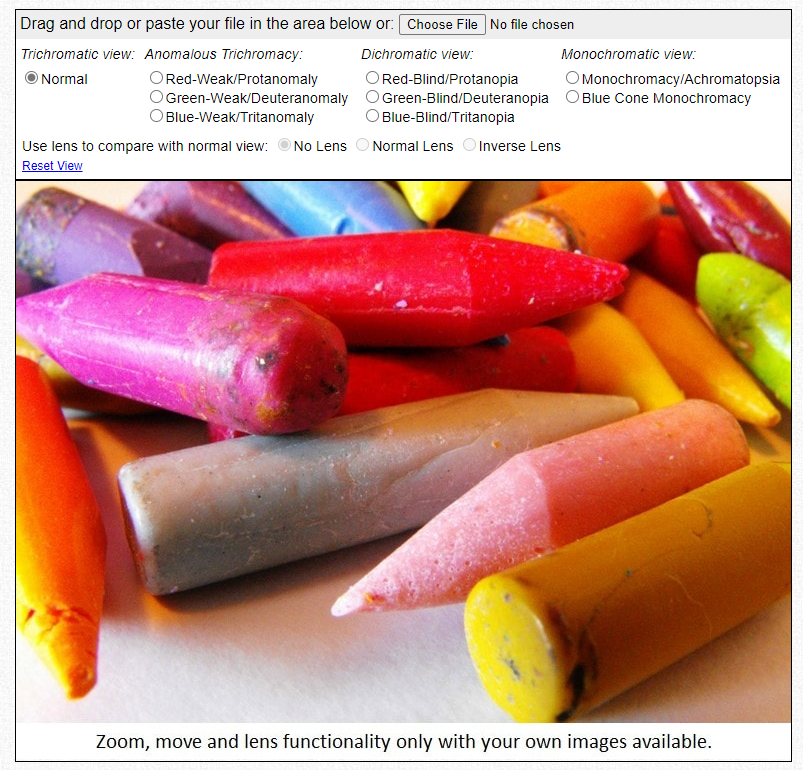

--- 
title: "Workflow for creating color blind friendly palettes"
date: "2022-08-08"
author: "Jadey N Ryan (@jadeynryan)  [GitHub](https://github.com/jadeynryan) | [Twitter](https://twitter.com/jadeynryan)"
---

As data scientists, we must effectively use color in our data visualizations to help **everyone** quickly and easily understand the patterns and relationships in the data.

[\@mxcatnap](https://twitter.com/mxcatnap) on Twitter inspired me to create this workflow/resource to create and test color blind friendly palettes by posting this [Datawrapper article](https://academy.datawrapper.de/article/140-what-to-consider-when-choosing-colors-for-data-visualization), which had so many great resources.

**Step 1. Use one of these color generators with built in accessibility checkers to create a palette.**

-   [**Adobe Color Wheel**](https://color.adobe.com/create/color-wheel/)
    -   Choose color harmony rule, customize, and then click 'check for accessibility'.

    -   Limit of 5 colors.

    -   Need to save palette to library to get the color codes.

        
-   [**Chroma.js Color Palette Helper**](https://gka.github.io/palettes/)
    -   Choose sequential or diverging palette type, number of colors, and then select/arrange your colors.

    -   Easily export color codes in different formats.

        
-   [**i want hue**](https://medialab.github.io/iwanthue/)
    -   Set your color space, check improve for the colorblind, choose number of colors, and then click 'make a palette'.

    -   Provides differentiation report and color vision deficiency with emojis.

    -   Easily export color codes in different formats.

        
-   [**Colorgorical**](http://vrl.cs.brown.edu/color)
    -   Choose number of colors, score importance, hue filters, lightness range, and starting colors, and then click 'generate'.

    -   Provides choropleth maps and various chart types to see your colors in action.

    -   Easily export color codes in different formats.

        

**Step 2. Test your palette.**

-   [**Viz Palette**](https://projects.susielu.com/viz-palette)

    -   Paste your color codes then click 'add' or 'replace' to see your colors in action in various chart types and color blindness types. View a color report that specifies which colors may be difficult to tell apart. It also identifies possible name conflicts.

    -   Edit your color palette then easily export color codes in different formats.

        

**Step 3. Upload your image and simulate various types of color blindness.**

-   [**Color Blindness Simulator**](http://www.color-blindness.com/coblis-color-blindness-simulator/)
    -   Upload your image and then click on the different types of color blindness to see how your image looks.

        

**Step 4. Reiterate until you have an accessible color palette for your data visualization!**

------------------------------------------------------------------------

**Cartographic specific palettes**

-   <https://colorbrewer2.org/>

-   <https://carto.com/carto-colors/>
